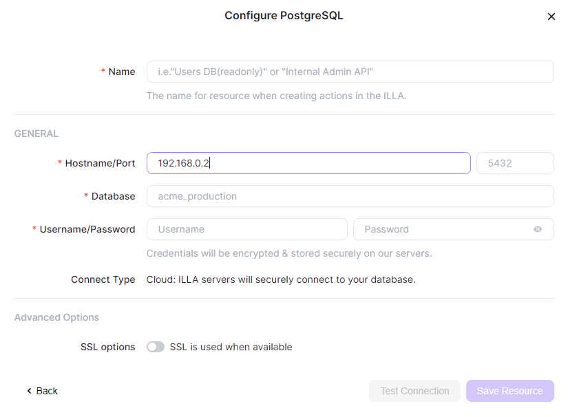

How to Connect My Postgres Database in Resource
-----------------------------------------------


## Desc

This document is for the user who wants to connect their postgres database in illa-builder.


## Can not Connect to `localhost` or `127.0.0.1`, why?



The illa-builder are run in docker container. So the localhost means container it self. 

When you want to connect your database on your local machine. You can input your machine's LAN IP as connection address.


## Determine Connection Address

Type linux command ```ip addr```. Then check out LAN IP address.

```
root@my-computer:/# ip addr
1: lo: <LOOPBACK,UP,LOWER_UP> mtu 65536 qdisc noqueue state UNKNOWN group default qlen 1000
    link/loopback 00:00:00:00:00:00 brd 00:00:00:00:00:00
    inet 127.0.0.1/8 scope host lo
       valid_lft forever preferred_lft forever
    inet6 ::1/128 scope host 
       valid_lft forever preferred_lft forever
2: ens3: <BROADCAST,MULTICAST,UP,LOWER_UP> mtu 1500 qdisc fq_codel state UP group default qlen 1000
    link/ether 1e:00:92:00:01:01 brd ff:ff:ff:ff:ff:ff
    inet 192.168.0.12/24 brd 192.168.0.255 scope global ens3
       valid_lft forever preferred_lft forever
3: docker0: <BROADCAST,MULTICAST,UP,LOWER_UP> mtu 1500 qdisc noqueue state UP group default 
    link/ether 02:42:99:6e:3e:11 brd ff:ff:ff:ff:ff:ff
    inet 172.17.0.1/16 brd 172.17.255.255 scope global docker0
       valid_lft forever preferred_lft forever
    inet6 fe80::42:99ff:fe6e:3e11/64 scope link 
       valid_lft forever preferred_lft forever

```


The Internet Assigned Numbers Authority (IANA) has assigned several address ranges to be used by private networks.

Address ranges to be use by private networks are:

- Class A: 10.0.0.0 to 10.255.255.255  
- Class B: 172.16.0.0 to 172.31.255.255  
- Class C: 192.168.0.0 to 192.168.255.255  

So, in the command return, the NIC **ens3** address **192.168.0.12**, is our LAN IP address.
